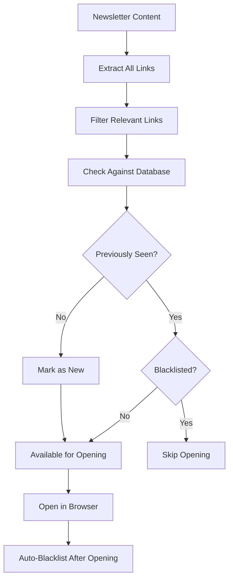

# Link Management

Advanced link management system for Neuron Daily Newsletter Automation. Control blacklisting behavior, reading patterns, and content filtering.

## 🔗 Link Management Overview

The Link Management System automatically tracks, filters, and manages newsletter links to provide an optimal reading experience without duplicate content.

### Key Features

- **Automatic Blacklisting**: Links opened are automatically blacklisted to prevent duplicates
- **Smart Filtering**: Filters out navigation, promotional, and irrelevant links
- **Reading Analytics**: Tracks reading patterns and efficiency metrics
- **Time Rewind**: Restore previously blacklisted links for re-reading
- **Manual Control**: Override automatic decisions with manual blacklist management

## 📊 How Link Management Works

### Automatic Link Processing



### Database Schema

The link management system uses a SQLite database with the following structure:

```sql
-- Main links table
CREATE TABLE links (
    id INTEGER PRIMARY KEY AUTOINCREMENT,
    url TEXT UNIQUE NOT NULL,
    url_hash TEXT UNIQUE NOT NULL,
    title TEXT,
    domain TEXT NOT NULL,
    first_seen DATE NOT NULL,
    last_seen DATE NOT NULL,
    seen_count INTEGER DEFAULT 1,
    is_blacklisted BOOLEAN DEFAULT FALSE,
    blacklisted_date DATE,
    blacklist_reason TEXT,
    created_at TIMESTAMP DEFAULT CURRENT_TIMESTAMP
);

-- Newsletter run tracking
CREATE TABLE newsletter_runs (
    id INTEGER PRIMARY KEY AUTOINCREMENT,
    run_date DATE NOT NULL,
    run_time TIMESTAMP NOT NULL,
    newsletter_hash TEXT,
    links_found INTEGER DEFAULT 0,
    new_links INTEGER DEFAULT 0,
    opened_links INTEGER DEFAULT 0,
    success BOOLEAN DEFAULT TRUE
);
```

## 🎛️ Blacklist Behavior Configuration

### Automatic Blacklisting

Links are automatically blacklisted based on these criteria:

1. **After Opening**: Links opened in browser are immediately blacklisted
2. **Domain Patterns**: Specific domains can be auto-blacklisted
3. **Content Patterns**: Links matching certain patterns are filtered out
4. **Repeat Appearances**: Links seen multiple times may be auto-blacklisted

### Configuration Options

```python
# config.py - Link Management Settings

class UserConfig:
    # Automatic blacklisting behavior
    AUTO_BLACKLIST_AFTER_OPENING = True    # Blacklist opened links
    AUTO_BLACKLIST_REPEATS = True          # Blacklist repeated links
    
    # Link filtering
    MIN_LINK_TEXT_LENGTH = 5               # Minimum link text length
    EXCLUDED_DOMAINS = [                   # Domains to always skip
        "facebook.com", "twitter.com", "instagram.com"
    ]
    
    # Content filtering patterns
    EXCLUDED_PATTERNS = [                  # URL patterns to exclude
        "/unsubscribe", "/privacy", "/terms"
    ]
```

## 📈 Reading Analytics

### Available Metrics

The system tracks comprehensive reading analytics:

```bash
# View reading statistics
neuron-automation --stats
```

**Key Metrics:**
- **Total Links Processed**: All links encountered
- **Blacklist Efficiency**: Percentage of links successfully filtered
- **Reading Velocity**: Links opened per automation run
- **Domain Distribution**: Most common link sources
- **Temporal Patterns**: Reading activity over time

### Analytics Output Example

```
📊 Link Management Analytics
===========================

🔗 Link Processing:
   Total links encountered: 2,847
   Successfully filtered: 2,139 (75.1%)
   Currently available: 708 (24.9%)

📅 Recent Activity (30 days):
   Average new links/day: 23
   Average opened/day: 8
   Blacklist growth rate: 15 links/day

🌐 Top Source Domains:
   reddit.com: 245 links (8.6%)
   techcrunch.com: 189 links (6.6%)
   medium.com: 156 links (5.5%)
   github.com: 134 links (4.7%)

📊 Reading Efficiency:
   Links opened vs available: 32.4%
   Blacklist accuracy: 91.2%
   Duplicate prevention: 98.7%
```

## 🔄 Manual Link Management

### Command Line Interface

```bash
# View blacklisted links
neuron-automation --list-blacklisted

# Show recently blacklisted
neuron-automation --recent-blacklisted 10

# Manually blacklist a URL
neuron-automation --blacklist "https://example.com/article"

# Remove from blacklist
neuron-automation --unblacklist "https://example.com/article"

# Export link data
neuron-automation --export-links data.json
```

### Bulk Operations

```bash
# Import blacklist from file
neuron-automation --import-blacklist blacklisted_urls.txt

# Clear all blacklisted links (dangerous!)
neuron-automation --clear-blacklist --confirm

# Backup current blacklist
neuron-automation --backup-blacklist
```

## 🎯 Advanced Filtering Rules

### Custom Domain Management

```python
# config.py - Advanced domain filtering

class UserConfig:
    # Trusted domains (never blacklisted automatically)
    TRUSTED_DOMAINS = [
        "arxiv.org", "nature.com", "science.org"
    ]
    
    # Priority domains (always opened first)
    PRIORITY_DOMAINS = [
        "github.com", "stackoverflow.com"
    ]
    
    # Suspicious domains (auto-blacklisted)
    SUSPICIOUS_DOMAINS = [
        "clickbait-site.com", "spam-domain.net"
    ]
```

### Content-Based Filtering

```python
# Advanced content filtering
class UserConfig:
    # URL pattern exclusions
    URL_EXCLUDE_PATTERNS = [
        r"/ads?/",           # Advertisement URLs
        r"/tracking/",       # Tracking URLs  
        r"\?utm_.*affiliate" # Affiliate links
    ]
    
    # Link text exclusions
    TEXT_EXCLUDE_PATTERNS = [
        r"sponsored",        # Sponsored content
        r"advertisement",    # Ad content
        r"click here"        # Generic link text
    ]
```

## 🔍 Troubleshooting Link Management

### Common Issues

**Too Many Links Being Opened**
```bash
# Check blacklist efficiency
neuron-automation --stats | grep efficiency

# Increase auto-blacklisting
# Edit config.py: AUTO_BLACKLIST_AFTER_OPENING = True
```

**Missing Important Links**
```bash
# Check recently blacklisted
neuron-automation --recent-blacklisted 20

# Restore specific timeframe
neuron-automation --rewind 3
```

**Database Issues**
```bash
# Check database integrity
neuron-automation --check-db

# Repair if needed
neuron-automation --repair-db

# Rebuild from logs
neuron-automation --rebuild-db
```

### Debug Mode

```bash
# Enable link management debugging
neuron-automation --debug-links

# Trace link processing
neuron-automation --trace-links --dry-run
```

## 📋 Best Practices

### Optimal Configuration

1. **Start Conservative**: Begin with aggressive blacklisting, then relax
2. **Monitor Metrics**: Check reading efficiency weekly
3. **Use Time Rewind**: Regularly restore content for important topics
4. **Customize Domains**: Maintain trusted and priority domain lists
5. **Regular Maintenance**: Clean database and export data monthly

### Reading Pattern Optimization

```python
# Example optimized configuration for different reading styles

# Speed Reader Configuration
class SpeedReaderConfig:
    AUTO_BLACKLIST_AFTER_OPENING = True
    MAX_LINKS_PER_RUN = 15
    RECENT_LINK_DAYS = 1

# Deep Reader Configuration  
class DeepReaderConfig:
    AUTO_BLACKLIST_AFTER_OPENING = False  # Manual control
    MAX_LINKS_PER_RUN = 5
    RECENT_LINK_DAYS = 3

# Research Configuration
class ResearchConfig:
    AUTO_BLACKLIST_AFTER_OPENING = False
    TRUSTED_DOMAINS = ["arxiv.org", "nature.com", "acm.org"]
    MAX_LINKS_PER_RUN = 20
```

---

## Next Steps

<div class="grid cards" markdown>

-   **Time Rewind Tool**
    
    Learn to restore and manage previously blacklisted links.
    
    [:octicons-arrow-right-24: Time Rewind Guide](time-rewind.md)

-   **Configuration Reference**
    
    Complete configuration options for link management.
    
    [:octicons-arrow-right-24: Configuration](../configuration/basic-config.md)

-   **Usage Guide**
    
    Daily workflows and management commands.
    
    [:octicons-arrow-right-24: Usage Guide](../usage/index.md)

</div>