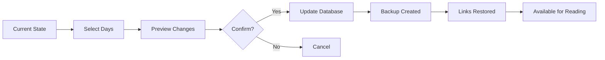

# Time Rewind Tool

The **Time Rewind Tool** is one of the most innovative features of Neuron Daily Newsletter Automation. It allows you to "go back in time" and restore previously blacklisted links, making them available for reading again.

!!! tip "Perfect for Learning Experiments"
    Use the Time Rewind Tool to test how re-introducing content affects your learning retention, or to recover from accidental over-blacklisting.

## How It Works

The Time Rewind Tool manipulates your local blacklist database to restore links that were blacklisted within a specified time period. When you "rewind" X days, all links blacklisted in the last X days become available again.



## Quick Examples

### Basic Rewind Commands

=== "Preview Mode (Safe)"

    ```bash
    # Preview what a 7-day rewind would restore
    neuron-automation --rewind-preview 7
    
    # See what would be restored from last 3 days
    neuron-automation --rewind-preview 3
    
    # Preview with detailed information
    neuron-automation --rewind-preview 5 --verbose
    ```

=== "Actual Rewind"

    ```bash
    # Restore links blacklisted in the last 5 days
    neuron-automation --rewind 5
    
    # Restore with automatic backup
    neuron-automation --rewind 7 --backup
    
    # Restore and show detailed results
    neuron-automation --rewind 3 --verbose
    ```

=== "Standalone Tool"

    ```bash
    # Use the dedicated blacklist-rewind tool
    blacklist-rewind --preview 7
    blacklist-rewind --rewind 5
    blacklist-rewind --stats
    blacklist-rewind --backup
    ```

### Viewing Recent Activity

```bash
# Show recently blacklisted content (last 10 items)
neuron-automation --recent-blacklisted 10

# Show blacklisted content from last 7 days
neuron-automation --recent-blacklisted 20 --days 7

# Export recent blacklist data
neuron-automation --recent-blacklisted --export blacklist_export.json
```

## Use Cases

### :material-school: Learning Experiments

Test different content exposure patterns to optimize your learning:

```bash
# Week 1: Read normally, let blacklist build up
neuron-automation

# Week 2: Restore last week's content for reinforcement
neuron-automation --rewind 7

# Week 3: Compare retention with/without re-exposure
```

### :material-book-open: Content Review

Bring back important articles for deeper study:

```bash
# Find articles blacklisted in the last 3 days
neuron-automation --recent-blacklisted 10 --days 3

# Restore them for re-reading
neuron-automation --rewind 3

# Next automation run will include these articles again
```

### :material-test-tube: Pattern Testing

Experiment with different blacklist cycles:

```bash
# Test 1-week cycle
neuron-automation --rewind 7

# Test 2-week cycle  
neuron-automation --rewind 14

# Compare reading variety and retention
```

### :material-backup-restore: Recovery Operations

Recover from accidental over-blacklisting:

```bash
# Check what was blacklisted recently
neuron-automation --recent-blacklisted 20

# Restore everything from last 2 days if too aggressive
neuron-automation --rewind 2

# Create backup before major changes
neuron-automation --rewind 10 --backup
```

## Advanced Features

### Backup Management

The Time Rewind Tool includes comprehensive backup capabilities:

```bash
# Create manual backup before major changes
blacklist-rewind --backup

# List available backups
blacklist-rewind --list-backups

# Restore from specific backup
blacklist-rewind --restore-backup 2025-01-15_10-30-45

# Clean old backups (keep last 10)
blacklist-rewind --cleanup-backups 10
```

### Analytics Integration

Track your rewind usage patterns:

```bash
# View rewind history and statistics
blacklist-rewind --stats

# Show impact of recent rewinds
blacklist-rewind --rewind-impact 7

# Export usage analytics
blacklist-rewind --export-analytics rewind_stats.json
```

### Selective Rewind

Target specific types of content:

```bash
# Rewind only links from specific domains
blacklist-rewind --rewind 7 --domain "techcrunch.com"

# Rewind links matching patterns
blacklist-rewind --rewind 5 --pattern "*artificial-intelligence*"

# Rewind by blacklist reason
blacklist-rewind --rewind 7 --reason "duplicate"
```

## Configuration Options

### Global Settings

Configure rewind behavior in `~/.config/neuron-automation/config.py`:

```python
# Time Rewind Configuration
TIME_REWIND_CONFIG = {
    'default_backup': True,           # Always create backups
    'backup_retention_days': 30,      # Keep backups for 30 days
    'max_rewind_days': 90,           # Maximum rewind period
    'confirmation_required': True,    # Ask for confirmation
    'verbose_output': False,         # Detailed output by default
}

# Backup Configuration
BACKUP_CONFIG = {
    'backup_directory': '~/.config/neuron-automation/backups/',
    'backup_filename_format': 'backup_%Y-%m-%d_%H-%M-%S.sqlite',
    'auto_cleanup': True,
    'max_backups': 20,
}
```

### Command-Line Overrides

Override configuration via command-line options:

```bash
# Disable confirmation prompts
neuron-automation --rewind 5 --no-confirm

# Force backup even if disabled in config
neuron-automation --rewind 7 --force-backup

# Use custom backup location
neuron-automation --rewind 5 --backup-dir /custom/path/
```

## Safety Features

### Automatic Backups

By default, the Time Rewind Tool creates backups before making changes:

```bash
# Backup location: ~/.config/neuron-automation/backups/
# Filename format: rewind_backup_2025-01-15_10-30-45.sqlite
```

### Confirmation Prompts

Interactive confirmation prevents accidental changes:

```
Time Rewind Preview for 7 days:

Links to be restored: 23 items
Date range: 2025-01-08 to 2025-01-15
Estimated impact: 23 additional links in next run

Are you sure you want to proceed? [y/N]: 
```

### Validation Checks

The tool validates all operations before execution:

- ✅ Database integrity checks
- ✅ Date range validation  
- ✅ Backup space availability
- ✅ Permission verification
- ✅ Configuration validation

## Database Schema

Understanding the underlying data structure:

```sql
-- Links table with blacklist tracking
CREATE TABLE links (
    id INTEGER PRIMARY KEY,
    url TEXT UNIQUE NOT NULL,
    url_hash TEXT UNIQUE NOT NULL,
    first_seen DATE NOT NULL,
    last_seen DATE NOT NULL,
    is_blacklisted BOOLEAN DEFAULT FALSE,
    blacklisted_date DATE,
    blacklist_reason TEXT,
    times_opened INTEGER DEFAULT 0
);

-- Rewind operations log
CREATE TABLE rewind_history (
    id INTEGER PRIMARY KEY,
    rewind_date DATE NOT NULL,
    days_rewound INTEGER NOT NULL,
    links_affected INTEGER NOT NULL,
    backup_created TEXT,
    operation_type TEXT
);
```

## Performance Considerations

### Database Size Impact

| Links in Database | Rewind Time | Backup Time | Disk Usage |
|------------------|-------------|-------------|------------|
| 1,000 links | <1 second | <1 second | ~50KB |
| 10,000 links | ~2 seconds | ~2 seconds | ~500KB |
| 100,000 links | ~5 seconds | ~5 seconds | ~5MB |

### Optimization Tips

1. **Regular Cleanup**: Use `--cleanup-old` to remove ancient entries
2. **Selective Operations**: Use filters to reduce operation scope  
3. **Batch Processing**: Group multiple rewind operations
4. **Monitor Size**: Check database size with `--stats`

## Troubleshooting

### Common Issues

!!! warning "Database Locked"
    If you get "database is locked" errors:
    ```bash
    # Stop the automation service temporarily
    sudo systemctl stop neuron-automation.timer
    
    # Run the rewind operation
    neuron-automation --rewind 7
    
    # Restart the service
    sudo systemctl start neuron-automation.timer
    ```

!!! warning "Backup Failed"
    If backup creation fails:
    ```bash
    # Check disk space
    df -h ~/.config/neuron-automation/
    
    # Use custom backup location
    neuron-automation --rewind 5 --backup-dir /tmp/
    
    # Disable backup if necessary
    neuron-automation --rewind 5 --no-backup
    ```

!!! warning "No Links to Restore"
    If no links match the time period:
    ```bash
    # Check recent blacklist activity
    neuron-automation --recent-blacklisted 20
    
    # Try a longer time period
    neuron-automation --rewind-preview 14
    
    # Check database status
    blacklist-rewind --stats
    ```

### Debug Mode

Enable detailed logging for troubleshooting:

```bash
# Enable debug output
neuron-automation --rewind 5 --debug

# Use standalone tool with verbose logging
blacklist-rewind --rewind 5 --verbose --debug

# Check log files
tail -f ~/.config/neuron-automation/logs/rewind.log
```

## Complete Documentation

For comprehensive usage examples, advanced workflows, and best practices:

📖 **[Full Blacklist Rewind Usage Guide](../../BLACKLIST_REWIND_USAGE.md)** 

---

## Next Steps

- [Configure Link Management](link-management.md) to understand blacklist behavior
- [Set up Analytics](../configuration/advanced-settings.md) to track rewind effectiveness  
- [Explore Advanced Usage](../usage/manual-commands.md) for power-user features