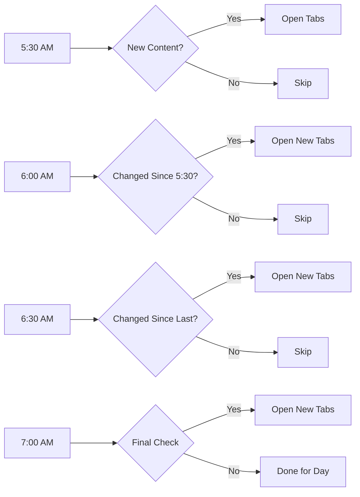

# Neuron Daily Newsletter Automation

<div class="grid cards" markdown>

-   :material-clock-fast:{ .lg .middle } **Smart Automation**

    ---

    Multiple scheduled runs with intelligent change detection ensure you never miss a newsletter, regardless of publication time.

    [:octicons-arrow-right-24: Getting started](installation/)

-   :material-link-variant:{ .lg .middle } **Link Management**

    ---

    Advanced blacklist system prevents duplicate reading and tracks analytics. Go back in time to restore content.

    [:octicons-arrow-right-24: Features](features/)

-   :material-cog:{ .lg .middle } **Cross-Platform**

    ---

    Works seamlessly on Linux, macOS, and Windows with automatic system integration and scheduling.

    [:octicons-arrow-right-24: Configuration](configuration/)

-   :material-chart-line:{ .lg .middle } **Professional Grade**

    ---

    Comprehensive logging, error recovery, and Chrome browser integration make this enterprise-ready.

    [:octicons-arrow-right-24: Reference](reference/)

</div>

## Why This Exists

Reading the **Neuron Daily newsletter** is a great way to start the day, but manually clicking through all the article links takes time. This automation opens everything at once, so you can spend your morning **reading instead of clicking**. 

Built collaboratively with Claude AI to solve a real daily workflow need.

!!! tip "Give it a star!"
    If this saves you time too, give it a :star: and let us know how it works for you!

## What It Does

This **cross-platform automation system** automatically opens the latest Neuron Daily newsletter with all article links in separate tabs every weekday morning.

**Supported Platforms:** :material-linux: Linux • :material-apple: macOS • :material-microsoft-windows: Windows

## Key Features

=== "Smart Scheduling"

    - **Multi-Run System**: 4 scheduled runs (5:30, 6:00, 6:30, 7:00 AM)
    - **Change Detection**: Prevents duplicate content opening
    - **Optimal Coverage**: Catches newsletters regardless of publication time
    - **Network Resilience**: Connectivity checks before running

=== "Link Management"

    - **Advanced Blacklisting**: Prevents duplicate reading
    - **Analytics Tracking**: Monitor blacklist efficiency over time
    - **Time Rewind Tool**: Restore previously blacklisted content
    - **Intelligent Filtering**: Removes ads and irrelevant links

=== "Browser Integration"

    - **Chrome Persistence**: Tabs stay open after automation
    - **Profile Integration**: Uses your bookmarks and extensions
    - **Smart Detection**: Connects to existing Chrome windows
    - **Error Handling**: Only successful runs leave browser open

=== "System Integration"

    - **Automatic Scheduling**: systemd/launchd/Task Scheduler
    - **Easy Installation**: pip install or platform installers
    - **Comprehensive Logging**: Detailed logs for troubleshooting
    - **Configuration**: Easily customizable settings

## Quick Start

Get up and running in under 2 minutes:

=== "pip Install"

    ```bash
    pip install neuron-automation
    neuron-automation --setup
    ```

=== "Manual Install"

    ```bash
    git clone https://github.com/pem725/NeuronAutomator.git
    cd NeuronAutomator
    ./installers/install_linux.sh  # or install_macos.sh / install_windows.ps1
    ```

=== "Test Run"

    ```bash
    neuron-automation
    ```
    
    This opens Chrome with the newsletter and all article tabs.

## How It Works

The automation uses a sophisticated approach that combines multiple scheduled runs with intelligent content detection:



**Result**: Perfect coverage with zero redundancy ✨

## Next Steps

<div class="grid cards" markdown>

-   **Install the System**
    
    Choose your installation method and get automated newsletter delivery set up in minutes.
    
    [:octicons-arrow-right-24: Installation Guide](installation/)

-   **Explore Features**
    
    Learn about the smart scheduling system, link management, and time rewind capabilities.
    
    [:octicons-arrow-right-24: Feature Overview](features/)

-   **Configure Settings**
    
    Customize the automation to match your reading preferences and schedule.
    
    [:octicons-arrow-right-24: Configuration](configuration/)

-   **Get Help**
    
    Find troubleshooting tips, command references, and contribution guidelines.
    
    [:octicons-arrow-right-24: Support](reference/)

</div>