# Usage Guide

Learn how to use Neuron Daily Newsletter Automation effectively. The system runs automatically, but offers powerful manual controls for advanced users.

## 🚀 Daily Operation

### Automatic Mode (Recommended)

Once installed, the system runs automatically every weekday morning:

```mermaid
graph LR
    A[5:30 AM] --> B{New Newsletter?}
    B -->|Yes| C[📖 Open Tabs]
    B -->|No| D[⏭️ Skip]
    
    E[6:00 AM] --> F{Changed?}
    F -->|Yes| G[📖 Open New Tabs] 
    F -->|No| H[⏭️ Skip]
    
    I[6:30 AM] --> J{Changed?}
    J -->|Yes| K[📖 Open New Tabs]
    J -->|No| L[⏭️ Skip]
    
    M[7:00 AM] --> N{Final Check}
    N -->|Yes| O[📖 Open New Tabs]
    N -->|No| P[✅ Done]
```



**What happens automatically:**
1. **Smart Detection**: Checks if newsletter content changed
2. **Link Extraction**: Finds article links from the newsletter
3. **Blacklist Filtering**: Skips previously opened links
4. **Browser Opening**: Opens Chrome with article tabs
5. **Database Update**: Records opened links

### Your Morning Routine

=== "Early Bird (6:00 AM)"

    1. **Wake up** → Newsletter tabs already open
    2. **Read articles** at your own pace  
    3. **Close tabs** when finished
    4. System automatically blacklists read articles

=== "Standard (7:00 AM)"

    1. **Check device** → Newsletter tabs waiting
    2. **Browse content** that interests you
    3. **Leave tabs open** for later reading
    4. System tracks what you've accessed

=== "Late Riser (8:00 AM+)"

    1. **Open browser** → Previous tabs still available
    2. **Catch up** on morning's articles
    3. **Use time rewind** to restore older content
    4. System adapts to your schedule

## 🎮 Manual Controls

### Basic Commands

```bash
# Run automation manually
neuron-automation

# Check system status
neuron-automation --status

# View statistics
neuron-automation --stats

# Show version information  
neuron-automation --version
```

### Link Management Commands

```bash
# View recent blacklisted links
neuron-automation --recent-blacklisted 10

# Time rewind (restore links from X days ago)
neuron-automation --rewind 7

# Preview rewind without making changes
neuron-automation --rewind-preview 5

# Show all blacklisted content
neuron-automation --show-blacklisted
```

### System Management Commands

```bash
# Test configuration and browser
neuron-automation --test

# Check system health
neuron-automation --health-check

# View effective configuration
neuron-automation --show-config

# Update system components
neuron-automation --update
```

## 📊 Understanding Statistics

### View Your Reading Analytics

```bash
neuron-automation --stats
```

**Sample output:**
```
📊 Neuron Automation Statistics
════════════════════════════════════════

🔗 Link Management:
   Total links processed: 1,247
   Currently blacklisted: 892 (71.5%)
   Available for reading: 355 (28.5%)
   
📅 Recent Activity (7 days):
   Newsletter runs: 28
   New links found: 156
   Links opened: 89
   Blacklist efficiency: 57.1%

⏰ Last Activities:
   Last run: 2025-01-15 06:30:15
   Last new content: 2025-01-15 06:30:15
   Database size: 2.3 MB
```

### Key Metrics Explained

| Metric | Meaning | Good Range |
|--------|---------|------------|
| **Blacklist efficiency** | % of links you don't see again | 60-80% |
| **Available for reading** | New content waiting | 20-50 links |  
| **Newsletter runs** | Automation executions | 20-35/week |
| **Database size** | Storage used | <10 MB |

## 🔄 Time Rewind Feature

### What is Time Rewind?

Restore previously blacklisted links to make them available for reading again. Perfect for:

- **Learning reinforcement**: Re-read important topics
- **Missed content**: Recover articles you meant to read
- **Testing patterns**: Experiment with content rotation
- **Accident recovery**: Undo over-aggressive blacklisting

### Quick Rewind Examples

```bash
# See what 7-day rewind would restore (safe preview)
neuron-automation --rewind-preview 7

# Restore links blacklisted in last 3 days
neuron-automation --rewind 3

# Restore everything from last week
neuron-automation --rewind 7 --backup

# Show recently blacklisted items
neuron-automation --recent-blacklisted 15
```

### Rewind Scenarios

=== "Daily Review"

    ```bash
    # Monday: Normal automation runs
    neuron-automation
    
    # Tuesday: Want to revisit Monday's content
    neuron-automation --rewind 1
    
    # Result: Yesterday's articles reappear
    ```

=== "Weekly Learning Cycle"

    ```bash
    # Friday: Review the entire week
    neuron-automation --rewind 7
    
    # Weekend: Re-read important articles
    # Monday: Fresh start with new blacklist
    ```

=== "Content Research"

    ```bash
    # Find articles about AI from last 14 days
    neuron-automation --recent-blacklisted 50 | grep -i "ai\|artificial"
    
    # Restore all recent content
    neuron-automation --rewind 14
    
    # Research specific topics
    ```

## 🎯 Advanced Usage

### Custom Automation Runs

```bash
# Force run even if no new content
neuron-automation --force

# Run with custom link limit
neuron-automation --max-links 20

# Run in test mode (no browser, show what would happen)
neuron-automation --dry-run

# Run with verbose output
neuron-automation --verbose
```

### Database Management

```bash
# Backup database
neuron-automation --backup-db

# Clean old entries
neuron-automation --cleanup --older-than 90

# Export data
neuron-automation --export-csv links_export.csv

# Database statistics
neuron-automation --db-stats
```

### Integration with Other Tools

#### Morning Script Integration
```bash
#!/bin/bash
# morning-routine.sh

echo "Starting morning automation..."
neuron-automation --stats
neuron-automation --health-check

if neuron-automation --dry-run | grep "new content"; then
    echo "📰 New newsletter content available!"
    neuron-automation
else
    echo "📭 No new content today"
fi
```

#### Cron Job Alternative
```bash
# Add to crontab for custom scheduling
# Run at 6:15 AM on weekdays
15 6 * * 1-5 /usr/local/bin/neuron-automation --quiet
```

## 🔧 Troubleshooting Usage

### Common Issues

!!! warning "No New Content Found"
    ```bash
    # Check newsletter URL
    neuron-automation --test-connection
    
    # Force refresh content detection
    neuron-automation --force --verbose
    
    # Check last successful run
    neuron-automation --stats
    ```

!!! warning "Too Many/Few Links Opening"
    ```bash
    # Adjust link limits
    neuron-automation --max-links 25
    
    # Check blacklist efficiency
    neuron-automation --stats
    
    # Reset blacklist if needed
    neuron-automation --reset-blacklist --confirm
    ```

!!! warning "Browser Not Opening"
    ```bash
    # Test browser configuration
    neuron-automation --test-browser
    
    # Check Chrome installation
    google-chrome --version
    
    # Try headless mode first
    neuron-automation --headless
    ```

### Debug Mode

```bash
# Enable detailed logging
neuron-automation --debug

# View recent logs
tail -50 ~/.config/neuron-automation/logs/neuron_automation.log

# Monitor live logging
tail -f ~/.config/neuron-automation/logs/neuron_automation.log
```

## 📱 Mobile & Cross-Device Usage

### Reading Across Devices

The automation runs on your main computer, but you can access the content anywhere:

1. **Sync bookmarks** across devices via Chrome sync
2. **Share links** using Chrome's sharing features  
3. **Save for later** using read-later services
4. **Export links** and access on mobile

### Remote Monitoring

```bash
# Check status remotely via SSH
ssh your-computer "neuron-automation --stats"

# Run automation remotely
ssh your-computer "neuron-automation --force"

# View logs remotely  
ssh your-computer "tail -20 ~/.config/neuron-automation/logs/neuron_automation.log"
```

---

## Next Steps

<div class="grid cards" markdown>

-   **Daily Operation**
    
    Master the automatic daily workflow and optimize your reading routine.
    
    [:octicons-arrow-right-24: Daily Workflow](daily-operation.md)

-   **Manual Commands**
    
    Complete reference for all available commands and options.
    
    [:octicons-arrow-right-24: Command Reference](manual-commands.md)

-   **System Management**
    
    Monitor, maintain, and troubleshoot your automation system.
    
    [:octicons-arrow-right-24: System Management](system-management.md)

-   **Time Rewind Guide**
    
    Advanced time rewind techniques and learning optimization strategies.
    
    [:octicons-arrow-right-24: Time Rewind Tool](../features/time-rewind.md)

</div>